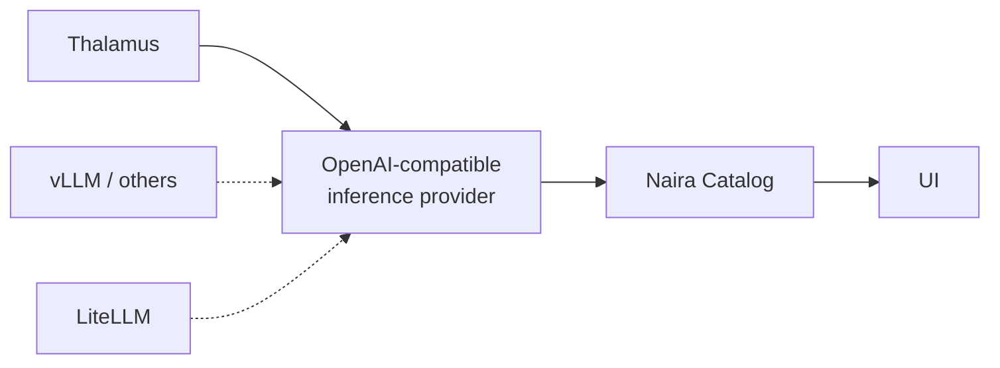

From **21 to 24 July** we spent four days at the SAP Innovation Center in Potsdam with other
open-source projects from the ApeiroRA (IPCEI-CIS) and NeoNephos ecosystem. SAP was so kind to provide us with food, drinks and many great minds working together on interesting projects in the IPCEI-CIS initiative.

The IPCEI-CIS Initiative is a program that brings sovereignty to Cloud Infrastructure and Services. Our Naira team joined the event with our still young and fresh software, looking for how to leverage the ecosystem and where to integrate with other solutions.

Our entire team could join the hackathon.

## From a Thalamus plugin to an inference provider abstraction

[Thalamus](https://github.com/cobaltcore-dev/thalamus) is a vendor-neutral, Kubernetes-native
inference service for sovereign LLM deployments. Models are declared as Kubernetes custom
resources, routing happens through the Gateway API Inference Extension, and weights, prompts and
context never leave the deployment perimeter. For anyone running regulated workloads that can't go
to a hyperscaler AI provider, that is the interesting part.

For Naira, Thalamus is a source of exactly the entities our catalog cares about: models and model
versions, and the inference endpoints that serve them. So we started where you'd expect with a
dedicated collector plugin, so that everything Thalamus serves shows up as a first-class, governed
asset in the catalog alongside the assets already there.

Then the plugin started looking familiar. Thalamus exposes an OpenAI-compatible API, and almost
everything we had written was talking to *that*.

The Thalamus plugin provided us the foundation for a **generic OpenAI API-compatible inference provider plugin**,
with Thalamus as the first implementation behind it. Anything else that speaks the same API can be
connected by pointing configuration at it, rather than by writing a new collector from scratch.
Provider-specific details stay in a thin layer where they belong.

This is the sort of refactor that is hard to argue for in a design review and obvious after an
afternoon of pair programming with the team that owns the other side of the API.

## An MCP server for Naira

The second track was about how people get at the catalog. The UI is one answer. It is not always
the fastest one, especially when the question is something like *which models are actually served in this environment, and who owns them*.

So we built an **MCP server for Naira** and wired a chat UI ([Open WebUI](https://openwebui.com/))
on top. It exposes catalog operations as MCP tools, which means you can ask what's available,
inspect an asset and its relationships, and trigger actions conversationally from the chat, or
from any MCP-capable client.

It is early and deliberately minimal. But it is a real artifact to iterate on, and it surfaced the
harder problem underneath: an agent is only as good as the context it can reach. The value grows with how much of the landscape the catalog has collected, and the challenge becomes correlating that
information and keeping it retrievable, which is a catalog problem, not a chatbot problem.

## Where Naira stops

We used also the time with
[kcp](https://www.kcp.io/), [Platform Mesh](https://platform-mesh.io/main/) and
[OCM](https://ocm.software/) to draw lines.

The useful conversations weren't about integrating for the sake of it. They were about which
concerns belong where: multi-tenant control planes and API management sit with kcp and Platform
Mesh; describing and transporting software components is OCM's problem; and what's genuinely left
for an AI engineering hub is the connected, queryable view across models, endpoints, integrations,
delivery state and ownership.

Being in one room with the people who own those answers saved weeks of asynchronous back-and-forth, and in a couple of cases stopped us from building something that already exists one layer down. For a project at our stage, knowing what *not* to build is worth as much as any feature.

## Try it, and tell us where it breaks

Everything above is in the open:

- Naira - [naira-project/naira](https://github.com/naira-project/naira)
- Thalamus - [cobaltcore-dev/thalamus](https://github.com/cobaltcore-dev/thalamus)

`task platform:deploy` gets you a local kind cluster with the full stack; the
[README](https://github.com/naira-project/naira#getting-started) has the details. Naira is alpha; 
APIs and concepts still change on short notice, so the most useful thing you can do right now is
run it against your own inference setup and open an
[issue](https://github.com/naira-project/naira/issues) or a
[discussion](https://github.com/naira-project/naira/discussions) when it doesn't fit.

If you run an OpenAI-compatible service that isn't Thalamus, we'd particularly like to hear whether
the new abstraction actually holds for you.

---

Naira, Thalamus, kcp, Platform Mesh and OCM are all part of the [ApeiroRA](https://apeirora.eu/) and
**8ra** activities, funded by the EU **IPCEI-CIS** and supported by companies such as SAP, who also
sponsored this hackathon.

### Funded by the European Union

We are a new project and part of ApeiroRA which is an Important Project of Common European Interest - Next Generation Cloud Infrastructures and Services (IPCEI-CIS).

🌐 ApeiroRA?
ApeiroRA is a reference blueprint for an open, flexible, secure, and compliant next-generation cloud-edge continuum and therefore a key contribution to IPCEI-CIS. At a high level, the projects of ApeiroRA allow users to provider-agnostically fetch, request and consume services, and for service providers to describe, offer and provision their services.

Learn more about ApeiroRA by checking out the official website at https://apeirora.eu/.

